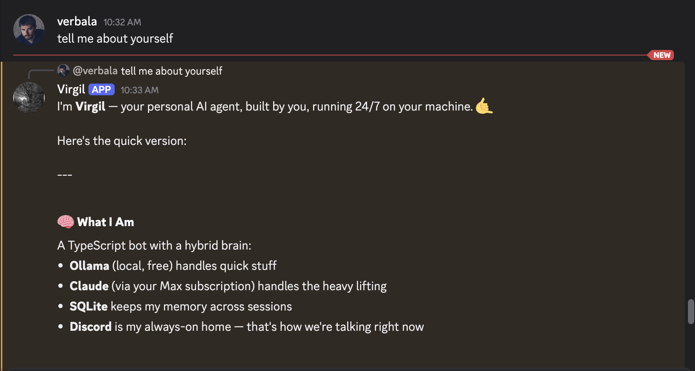
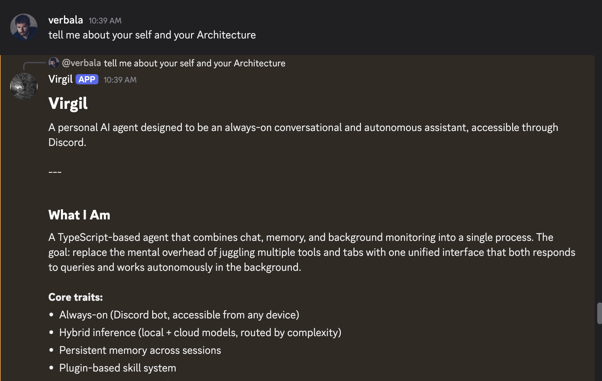
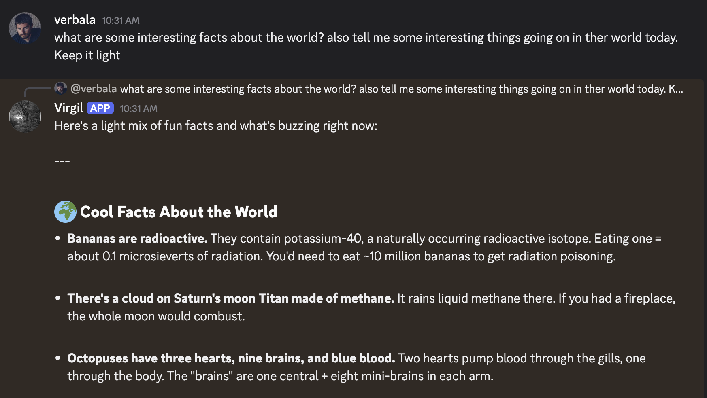

```
                    ___      ___ ___  ________  ________  ___  ___
                   |\  \    /  /|\  \|\   __  \|\   ____\|\  \|\  \
                   \ \  \  /  / | \  \ \  \|\  \ \  \___|\ \  \ \  \
                    \ \  \/  / / \ \  \ \   _  _\ \  \  __\ \  \ \  \
                     \ \    / /   \ \  \ \  \\  \\ \  \|\  \ \  \ \  \____
                      \ \__/ /     \ \__\ \__\\ _\\ \_______\ \__\ \_______\
                       \|__|/       \|__|\|__|\|__|\|_______|\|__|\|_______|
```

A personal AI agent framework that routes conversations between a local model (Ollama) and a cloud model (Claude CLI). ~6,000 lines of TypeScript, one SQLite database.

---

## In action

<p align="center">
  
  <br />
  <em>Self-introduction over Discord — hybrid routing, persistent memory, always-on.</em>
</p>

<p align="center">
  
  <br />
  <em>Virgil describing its own architecture and core traits.</em>
</p>

<p align="center">
  
  <br />
  <em>Open-ended query routed to Claude — rich markdown renders natively in Discord.</em>
</p>

---

## Overview

Virgil is a gateway-based agent that accepts messages from Discord or a console REPL, classifies them, and dispatches them to the appropriate backend. Simple messages are handled locally by Ollama; complex messages are routed to Claude via its CLI subprocess. If Ollama is unavailable, all traffic fails over to Claude automatically.

### Key capabilities

- **Dual-model routing** — Tier 1 regex fast-path + Tier 2 Ollama-based classification with automatic failover
- **Discord integration** — threaded conversations, slash commands, typing indicators, code-fence-aware message splitting
- **9 sandboxed skills** — file ops (path-traversal-safe), web fetching, system info, whitelisted shell commands
- **Persistent memory** — SQLite (WAL mode) with per-user/per-thread sessions and automatic context compaction
- **Background monitors** — configurable scheduled scrapers (Spotify, 1001Tracklists, jobs pages, weather, GitHub) with Discord notifications
- **Heartbeat monitoring** — 30s health checks with state change events and automatic rerouting

---

## Capabilities

### Conversation routing

Messages are classified and routed automatically. Simple exchanges stay on the local model; anything requiring reasoning, code, or tool use goes to Claude.

```
you> hey, what's up?
  [route] → ollama (0.95) [fast-path] Greeting detected
virgil> Hey! All good here. What are you working on?

you> can you review this function and suggest improvements?
  [route] → claude (0.95) [fast-path] Complex analysis detected
virgil> Looking at the function, there are a few things...
```

### Discord integration

Supports DMs, server channels, and threaded conversations. Slash commands provide direct access to agent features.

```
/ask prompt: What's the difference between a mutex and a semaphore?
/status
/skill name: file-read args: config/virgil.yaml
/skill name: list
```

### Skills

Nine built-in skills, all sandboxed. File operations enforce path traversal protection. Shell commands run against a whitelist via `execFile()` (no shell eval).

| Skill | Description |
|-------|-------------|
| `file-read` | Read a file's contents (max 1MB) |
| `file-write` | Create or overwrite a file |
| `file-search` | Recursive filename search (max depth 6, max 50 results) |
| `file-list` | List directory contents |
| `web-fetch` | Fetch URL content with SSRF protection |
| `system-info` | Host CPU, memory, and uptime |
| `process-list` | Running processes sorted by CPU/memory |
| `shell-exec` | Run whitelisted commands (`ls`, `grep`, `wc`, `df`, etc.) |
| `disk-usage` | Disk space summary |

### Background monitors

Configurable scheduled scrapers that run independently and deliver notifications via Discord DM. All use public pages — no API keys required.

| Monitor | Default interval | Description |
|---------|-----------------|-------------|
| Spotify | 1h | Track follower count, monthly listeners, popularity changes |
| 1001Tracklists | 6h | Detect new DJ support for tracked artists |
| Jobs | 2h | Scrape any careers page for keyword-matched listings |
| Daily briefing | Once daily | Weather, GitHub notifications, Spotify stats, DJ support digest |

### Context management

Conversations persist across messages in SQLite. When a session exceeds 40 turns, older history is summarized by Ollama and pruned — keeping context windows manageable without losing important information.

```
  [compaction] session=abc123 summarized=28 pruned=26
```

---

## Architecture

```
  Discord / Console
         │
    ┌────▼────┐
    │ Gateway │──→ normalize → route → dispatch → record → respond
    └────┬────┘
         │
    ┌────▼────┐    ┌──────────┐
    │ Router  │    │ Sessions │  per-user, per-thread isolation
    └──┬───┬──┘    └──────────┘
       │   │
   ┌───▼┐ ┌▼────┐  ┌──────────┐
   │Olla│ │Clau │  │  Skills  │  9 built-in, path-safe, whitelisted
   │ ma │ │ de  │  └──────────┘
   └────┘ └─────┘  ┌──────────┐  ┌──────────┐  ┌──────────┐
                    │Heartbeat │  │  Memory  │  │ Monitors │
                    │  (30s)   │  │ (SQLite) │  │(scheduled│
                    └──────────┘  └──────────┘  └──────────┘
```

**Router**: Regex fast-path (0ms) for obvious patterns. Ollama classification (2s timeout) for everything else. Low confidence (<0.7), timeout, or Ollama unavailable → routes to Claude.

**Memory**: SQLite with WAL mode. Up to 30 recent turns in context. Sessions exceeding 40 turns are compacted — older turns are summarized by Ollama and pruned.

**Monitors**: Configurable scheduled tasks with rate-limited Discord notifications. All scrapers use public pages (no API keys required).

### Design decisions

**Claude integration** is modeled after the [Claude Agent SDK](https://docs.anthropic.com/en/docs/agents/agent-sdk)'s `SubprocessCLITransport` pattern, reimplemented in TypeScript. Claude runs as a subprocess with `--output-format stream-json`, output is parsed as NDJSON. The subprocess runs with `cwd` set to `$HOME` for process-level isolation — it cannot read the project source, config, or `.env`.

**Security model** uses application-level guardrails:
- Path traversal protection on all file operations and shell command arguments
- Command whitelist via `execFile()` (no shell string eval)
- SSRF protection blocking private/loopback/link-local addresses in web fetches
- Credential separation — secrets in environment variables, never in agent-accessible state

---

## Getting started

### Prerequisites

- **Node.js** >= 20 (`nvm use` — `.nvmrc` included)
- **Ollama** running locally (`brew install ollama && ollama serve`)
- **Claude CLI** on PATH (authenticated)
- **Discord bot token** (optional — console mode works without one)

### Setup

```bash
git clone https://github.com/your-org/virgil.git
cd virgil
npm install
cp .env.example .env          # add your Discord token
ollama pull qwen2.5-coder:1.5b
```

### Configuration

- `config/virgil.yaml` — runtime config (models, channels, monitors, memory thresholds)
- `config/SOUL.md` — agent personality and behavioral rules (parsed into system prompt)

### Run

```bash
npm run dev                    # development (tsx)
npm run build && npm start     # production (compiled)
```

### Console commands

- `/status` — backend health
- `/skills` — list available skills
- `/briefing` — trigger daily briefing

---

## Project structure

```
virgil/
├── src/
│   ├── index.ts           # Bootstrap, console REPL, graceful shutdown
│   ├── gateway/           # Message bus, router, sessions, config loader
│   ├── backends/          # Ollama REST client, Claude CLI subprocess
│   ├── channels/          # Discord bot, unified message types
│   ├── skills/            # File ops, web fetch, system tools (all sandboxed)
│   ├── memory/            # SQLite store, context compaction
│   ├── monitors/          # Spotify, tracklists, jobs, briefings, weather, GitHub
│   └── heartbeat/         # Health checks, state change events
├── config/
│   ├── SOUL.md            # Agent personality and rules
│   └── virgil.yaml        # Runtime config
└── data/                  # SQLite + PID lockfile (gitignored)
```
